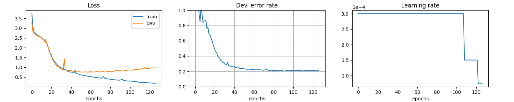
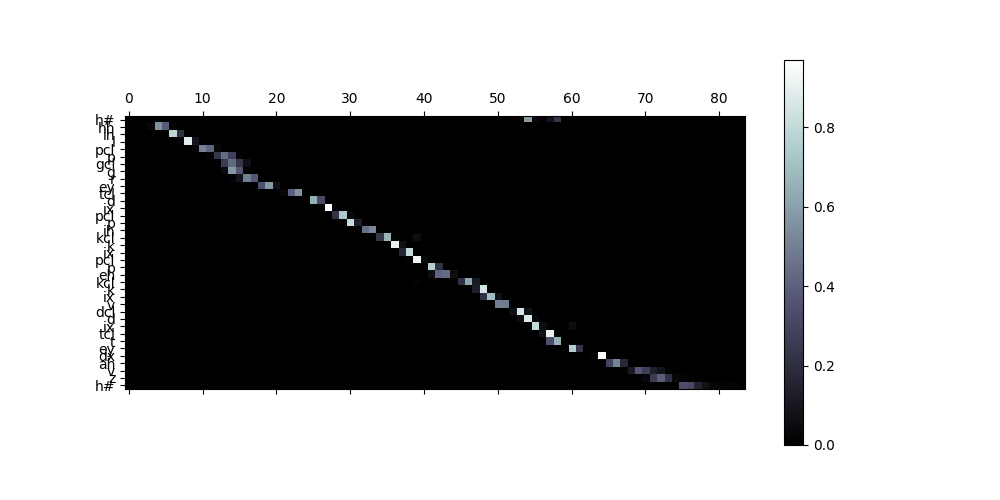

# Pytorch-End-to-End-ASR-on-TIMIT

BiGRU encoder + Attention decoder, based on **"Listen, Attend and Spell"**<sup>[1](#References)</sup>.

The acoustic features are 80-dimensional filter banks. They are stacked every 3 consecutive frames, so the time resolution is reduced.

Following the standard recipe, we use 462-speaker training set with all SA records removed. Outputs are mapped to 39 phonemes when evalauting.

With this code you can achieve **~22% PER** on the **core test set**.

## Usage
### Install requirements
```bash
$ pip install -r requirements.txt
```

### Prepare data
This will create lists (*.csv) of audio file paths along with their transcripts:
```bash
$ python prepare_data.py --root ${DIRECTORY_OF_TIMIT}
```

### Train
Check available options:
```bash
$ python train.py -h
```
Use the default configuration for training:
```bash
$ python train.py exp/default.yaml
```
You can also write your own configuration file based on `exp/default.yaml`.
```bash
$ python train.py ${PATH_TO_YOUR_CONFIG}
```

### Show loss curve
With the default configuration, the training logs are stored in `exp/default/history.csv`.
Specify your training logs accordingly.
```bash
$ python show_history.py exp/default/history.csv
```


### Test
During training, the program will keep monitoring the error rate on development set.
The checkpoint with the lowest error rate will be saved in the logging directory (by default `exp/default/best.pth`).

To evalutate the checkpoint on test set, run:
```bash
$ python eval.py exp/default/best.pth
```

Or you can test random audio from the test set and see the attentions:
```bash
$ python inference.py exp/default/best.pth

Predict:
h# l ae f tcl t ae n tcl s en s iy ng ix f ao r tcl ch ax m s epi l aw z ax pcl p l eh n y axr h#
Ground-truth:
h# l ae f dcl d ae n tcl t s en s ih ng ih f ao r tcl ch ix n s epi m ay l z ax pcl p aa n y ux h#
```



## References
[1] W. Chan _et al._, "Listen, Attend and Spell",
https://arxiv.org/pdf/1508.01211.pdf

[2] J. Chorowski _et al._, "Attention-Based Models for Speech Recognition",
https://arxiv.org/pdf/1506.07503.pdf

[3] M. Luong _et al._, "Effective Approaches to Attention-based Neural Machine Translation",
https://arxiv.org/pdf/1508.04025.pdf
